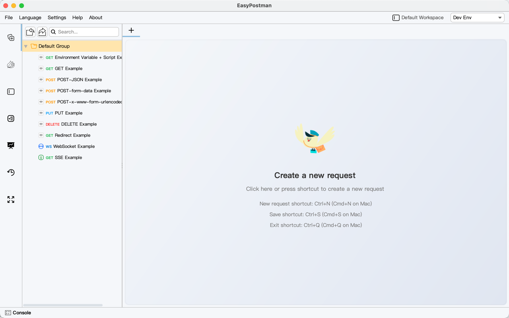
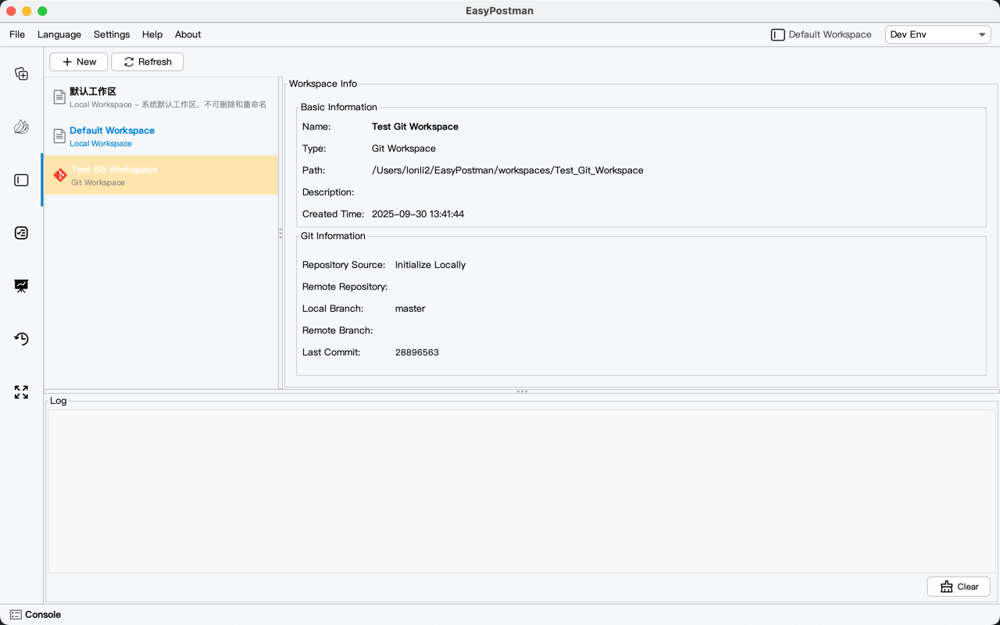
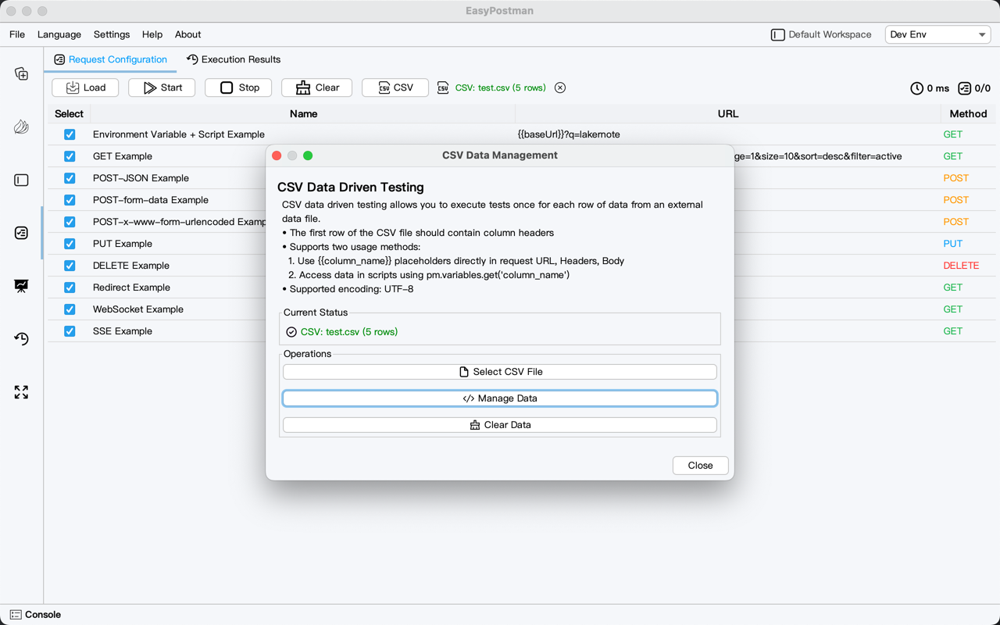
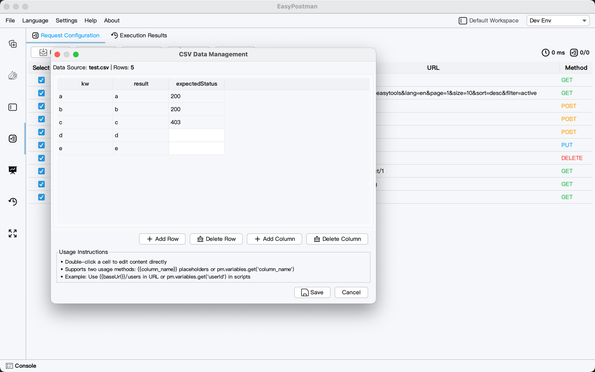
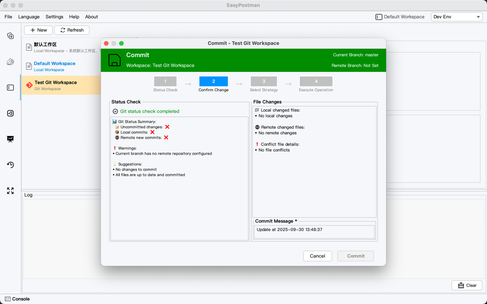

[中文](README_CN.md) | English

# EasyPostman

> 🚀 An open-source API debugging and stress testing tool inspired by Postman and a simplified JMeter, optimized for
> developers with a clean UI and powerful features. Built-in Git integration for team collaboration and version control.


## 💡 Project Introduction

EasyPostman aims to provide developers with a local API debugging experience comparable to Postman, and integrates batch
requests and stress testing capabilities similar to a simplified JMeter. Built with Java Swing, it runs cross-platform,
works offline, and protects your API data privacy. With built-in Git workspace support, you can manage API data versions
and collaborate with your team, enabling seamless multi-device sync and teamwork.

### 🔥 Philosophy

- **🎯 Focus on Core Features** - Simple yet powerful, rich features without bloat
- **🔒 Privacy First** - Local storage, no cloud sync, your data stays private
- **🚀 Performance Oriented** - Native Java app, fast startup, smooth experience

---

## 🔗 Links

- 🌟 GitHub: [https://github.com/lakernote/easy-postman](https://github.com/lakernote/easy-postman)
- 🏠 Gitee: [https://gitee.com/lakernote/easy-postman](https://gitee.com/lakernote/easy-postman)
- 📦 **Download**: [https://github.com/lakernote/easy-postman/releases](https://github.com/lakernote/easy-postman/releases)
    - 🌏 China Mirror: [https://gitee.com/lakernote/easy-postman/releases](https://gitee.com/lakernote/easy-postman/releases)
    - 🍏 Mac (Apple Silicon): EasyPostman-latest.dmg
    - 🪟 Windows: EasyPostman-latest.msi
- 💬 WeChat: **lakernote**

---

## ✨ Features

- 🚦 Supports common HTTP methods (GET/POST/PUT/DELETE, etc.)
- 📡 Supports SSE (Server-Sent Events) and WebSocket protocols
- 🌏 Environment variable management for easy switching
- 🕑 Auto-saved request history for review and reuse
- 📦 Batch requests & stress testing (simplified JMeter), supports report, result tree, and trend chart visualization
- 📝 Syntax highlighting request editor
- 🌐 Multi-language support (Simplified Chinese, English)
- 💾 Local data storage for privacy and security
- 📂 Import/Export Postman v2.1, curl format
- 📊 Visualized response results, supports JSON/XML
- 🔍 Configurable request parameters, headers, cookies, etc.
- 📂 File upload and download support
- 📑 Request scripts (Pre-request Script, Tests)
- 🔗 Request chaining support
- 🧪 Detailed network request event monitoring and analysis
- 🏢 Workspace management - supports local and Git workspaces for project-level data isolation and version control
- 🔄 Git integration - supports commit, push, pull, and other version control operations
- 👥 Team collaboration - share API data via Git workspace

---

## 🖼️ Screenshots

|                                 Preview                                  |                                  Preview                                   |
|:------------------------------------------------------------------------:|:--------------------------------------------------------------------------:|
|                                                    |                                                |
|                                                    |                                          |
|                                      |                          |
|                                    |                                          |
|                                    |                                      |
|                                              |                              |
|                                |                                          |
|                                      |                          |
|                |                            |
|  |  |
|  |  |
|                                        |                                        |
|                              |                      |

---

## 🏗️ Architecture

```
EasyPostman
├── 🎨 UI Layer
│   ├── Workspace management
│   ├── Collections management
│   ├── Environments configuration
│   ├── History records
│   ├── Performance testing module
│   └── NetworkLog monitoring
├── 🔧 Business Layer
│   ├── HTTP request engine
│   ├── Workspace switching and isolation
│   ├── Git version control engine
│   ├── Environment variable resolver
│   ├── Script execution engine
│   ├── Data import/export module
│   └── Performance test executor
├── 💾 Data Layer
│   ├── Workspace storage management
│   ├── Local file storage
│   ├── Git repository management
│   ├── Configuration management
│   └── History management
└── 🌐 Network Layer
    ├── HTTP/HTTPS client
    ├── WebSocket client
    ├── SSE client
    └── Git remote communication
```

---

## 🛠️ Technology Stack

### Core

- **Java 17**: Modern LTS version for latest Java features
- **JavaSwing**: Native desktop GUI, cross-platform
- **jlink & jpackage**: Official packaging tools for native installers

### UI Libraries

- **FlatLaf**: Modern UI theme, dark mode, HiDPI support
- **RSyntaxTextArea**: Syntax highlighting editor for JSON/XML/JavaScript
- **jIconFont-Swing**: Vector icon font support
- **SwingX**: Extended Swing components
- **MigLayout**: Powerful layout manager

### Network & Utilities

- **OkHttp**: High-performance HTTP client
- **Nashorn/GraalVM**: JavaScript engine support
- **SLF4J + Logback**: Logging framework

---

## 🎯 Key Features in Detail

### 🏢 Workspace Management - Major Update!

- ✅ Local workspace: for personal projects, data stored locally, privacy guaranteed
- ✅ Git workspace: version control and team collaboration
    - Clone from remote: directly clone from GitHub/Gitee, etc.
    - Local init: create a local Git repo, push to remote later
- ✅ Project-level data isolation: each workspace manages its own collections and environments
- ✅ Quick workspace switching: one-click switch, no interference
- ✅ Git operations:
    - Commit: save local changes to version control
    - Push: push local commits to remote
    - Pull: fetch latest changes from remote
    - Conflict detection and smart handling
- ✅ Team collaboration: share API data via Git workspace
- ✅ Multiple authentication: username/password, Personal Access Token, SSH Key

### 🔌 API Debugging

- ✅ Supports HTTP/1.1 and HTTP/2
- ✅ Full REST API methods (GET/POST/PUT/DELETE/PATCH/HEAD/OPTIONS)
- ✅ Multiple request body formats: Form Data, x-www-form-urlencoded, JSON, XML, Binary
- ✅ File upload/download (drag & drop supported)
- ✅ Cookie auto-management and manual editing
- ✅ Visual editing for headers and query params
- ✅ Formatted response display (JSON, XML, HTML)
- ✅ Response time, status code, size statistics

### 🌍 Environment Management

- ✅ Quick environment switching (dev/test/prod)
- ✅ Global and environment variables
- ✅ Nested variable reference: `{{baseUrl}}/api/{{version}}`
- ✅ Dynamic variables: `{{$timestamp}}`, `{{$randomInt}}`
- ✅ Import/export environments

### 📝 Script Support

- ✅ Pre-request Script: run before request
- ✅ Tests Script: run after response
- ✅ Built-in code snippets
- ✅ JavaScript runtime
- ✅ Assertion support

### ⚡ Performance Testing

- ✅ Multiple thread group modes:
    - Fixed: stable load
    - Ramp-up: gradually increasing load
    - Stair-step: staged load
    - Spike: burst load
- ✅ Real-time performance monitoring
- ✅ Detailed test reports (response time, TPS, error rate)
- ✅ Result tree analysis
- ✅ Performance trend charts

### 📊 Data Analysis

- ✅ Request history timeline
- ✅ Detailed network event logs
- ✅ Response data statistics
- ✅ Auto-categorized error requests

### 🔄 Data Migration

- ✅ Import Postman Collection v2.1
- ✅ Import cURL commands
- ✅ Import HAR files (in development)
- ✅ Import OpenAPI/Swagger (in development)

---

## 🚀 Quick Start

### Requirements

- Java 17 or above
- Memory: at least 512MB available
- Disk: at least 100MB available

### Build from Source

```bash
# Clone the repo
git clone https://gitee.com/lakernote/easy-postman.git
cd easy-postman

# Or build and run
mvn clean package
java -jar target/easy-postman-*.jar
```

### Generate Installer

```bash
# macOS
chmod +x build/mac.sh
./build/mac.sh

# Windows
build/win.bat
```

---

## 📖 User Guide

### 0️⃣ Workspace Management (New!)

#### Create Workspace

1. Click the **Workspace** tab on the left
2. Click **+ New**
3. Choose workspace type:
    - **Local workspace**: for personal use, data stored locally
    - **Git workspace**: for version control and team collaboration
4. Enter workspace name, description, and path
5. If Git workspace, configure Git info:
    - **Clone from remote**: enter Git repo URL and credentials
    - **Local init**: create local Git repo, configure remote later

#### Team Collaboration Workflow

1. **Team Leader**:
    - Create Git workspace (clone or local init)
    - Configure API collections and environments
    - Commit and push to remote
2. **Team Members**:
    - Create Git workspace (clone from remote)
    - Get latest API data and environments
    - Commit and push updates after local changes
3. **Daily Collaboration**:
    - Before work: **Pull** to get latest changes
    - After changes: **Commit** local changes
    - Share updates: **Push** to remote

### 1️⃣ Create Your First Request

1. Click **Collections** tab
2. Right-click to create new collection and request
3. Enter URL and select HTTP method
4. Configure request params and headers
5. Click **Send**

### 2️⃣ Environment Configuration

1. Click **Environments** tab
2. Create new environment (e.g. dev, test, prod)
3. Add variables: e.g. `baseUrl = https://api.example.com`
4. Use in requests: `{{baseUrl}}/users`

### 3️⃣ Performance Testing

1. Click **Performance** tab
2. Configure thread group params
3. Add APIs to test
4. Start test and view real-time report

---

## 🤝 Contribution Guide

All contributions are welcome!

### How to Contribute

1. 🐛 **Bug Report**: [Submit Issue](https://gitee.com/lakernote/easy-postman/issues)
2. 💡 **Feature Request**: [Request Feature](https://gitee.com/lakernote/easy-postman/issues)
3. 📝 **Code Contribution**: Fork -> Edit -> Pull Request
4. 📚 **Docs Improvement**: Improve README, Wiki, etc.

### Development Guidelines

- Follow Java coding standards
- Run tests before commit: `mvn test`
- Commit message format: `feat: add new feature` or `fix: bug fix`

---

## ❓ FAQ

### Q: Why local storage instead of cloud sync?

A: We value developer privacy. Local storage ensures your API data is never leaked to third parties.

### Q: How to import Postman data?

A: In the Collections view, click Import and select a Postman v2.1 JSON file.

### Q: Are performance test results accurate?

A: Based on Java multithreading, results are for reference. For critical scenarios, compare with professional tools.

### Q: Does it support team collaboration?

A: ✅ **Now supported!** Use Git workspace to share API collections, environments, and more for real team collaboration.

### Q: Is data isolated between workspaces?

A: Yes. Each workspace is fully independent with its own collections and environments.

### Q: Which Git platforms are supported?

A: All standard Git platforms: GitHub, Gitee, GitLab, self-hosted, etc. Just provide a standard Git URL.

### Q: How to resolve Git conflicts?

A: Built-in conflict detection. Before Git operations, the system checks for conflicts and provides solutions like
auto-commit or stash.

### Q: Can I sync workspaces across devices?

A: Yes! With Git workspace, you can clone the same repo on different devices for cross-device sync.

---

## 💖 Support the Project

If you find this project helpful, please:

- ⭐ Star the project
- 🍴 Fork and contribute
- 📢 Recommend to friends
- ☕ Buy the author a coffee

---

## ⭐ Star History

[](https://star-history.com/#lakernote/easy-postman&Date)

---

## 🙏 Acknowledgements

Thanks to the following open-source projects:

- [FlatLaf](https://github.com/JFormDesigner/FlatLaf) - Modern Swing theme
- [RSyntaxTextArea](https://github.com/bobbylight/RSyntaxTextArea) - Syntax highlighting editor
- [OkHttp](https://github.com/square/okhttp) - HTTP client

---

<div align="center">

**Make API debugging easier, make performance testing more intuitive**

Made with ❤️ by [laker](https://github.com/lakernote)

</div>
